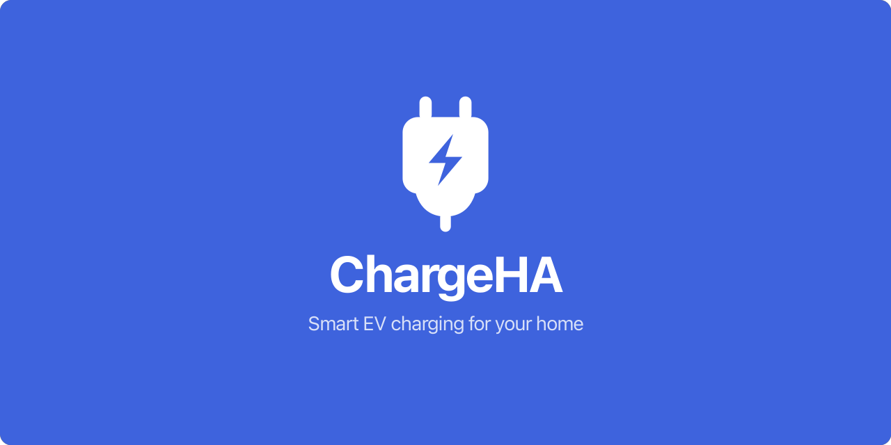

<p align="center">
  
</p>

Solar-aware EV charge controller for home automation. ChargeHA monitors your
solar production and intelligently manages EV charging to maximise
self-consumption — with advanced scheduling and notifications. Set and forget.

## Demo

ChargeHA has a demo mode that lets you review the features without installing.
It runs entirely in the browser.
[Try it here](https://startswithaj.github.io/ChargeHA/).

## ChargeHQ.net

ChargeHA is a self-hosted app that aims to have feature parity with
[ChargeHQ](https://chargehq.net/). ChargeHQ is a very stable, reliable charge
controller. It's only $7.99 AUD, so highly recommended if you don't care about
self-hosting.

ChargeHA is not affiliated with, endorsed by, or associated with ChargeHQ.

## Features

- **Solar tracking** — dynamically adjusts charging amps based on available
  solar excess (or gross production), with configurable grace periods to ride
  out cloud cover
- **Solar + grid fallback** — optionally draw from the grid at minimum amps when
  solar is insufficient, instead of stopping entirely
- **Home battery priority** — hold EV charging until your home battery reaches a
  configured state-of-charge threshold
- **Charge scheduling** — time-based schedules with day-of-week selection,
  per-vehicle amperage, and target charge limits
- **Blockout schedules** — prevent charging during peak tariff windows
- **Real-time dashboard** — live energy flow diagram showing solar, grid,
  battery, and EV power with vehicle status cards
- **Notifications** — Telegram alerts for charge start/stop, plug events, low
  solar, energy outages, and errors
- **Setup wizard** — guided first-run configuration for vehicles, inverters,
  location, and auth
- **Plugin architecture** — modular adapters for vehicles and energy sources,
  extensible without touching core code

### Reporting

- **Tariff-aware cost tracking** — records the active electricity rate per
  reading and breaks down charging costs by tariff period
- **Historical stats** — day/month/year charts for energy production,
  consumption, and charging costs with per-vehicle breakdowns

## Supported Integrations

| Category      | Integration         | Details                                                                         |
| ------------- | ------------------- | ------------------------------------------------------------------------------- |
| Vehicles      | **Tesla**           | Fleet API with virtual key pairing, charge control, wake, and location tracking |
| Vehicles      | **Simulated**       | Demo/dev adapter with adjustable SOC and plug state                             |
| Energy        | **Fronius (local)** | Direct HTTP polling of inverters on your LAN, with auto-discovery               |
| Energy        | **Fronius (cloud)** | Remote monitoring via the Fronius Solar API                                     |
| Notifications | **Telegram**        | Alerts for charging events, errors, and energy outages                          |
| Auth          | **OIDC**            | Single sign-on via any OpenID Connect provider                                  |

### Coming Soon

| Category | Integration                    | Details                                                                          |
| -------- | ------------------------------ | -------------------------------------------------------------------------------- |
| Energy   | **More inverters**             | SolarEdge, Sungrow, GoodWe, and Growatt — the most popular brands beyond Fronius |
| Chargers | **Smart Chargers (OCPP 1.6J)** | Wallbox, ZJ Beny, MG Chargehub, and 20+ OCPP-compatible brands over LAN          |

## Notes about Tesla

Tesla provide private users with $10 USD of Fleet API credit per month. The
billable calls ChargeHA uses are:

- **Wake** (~$0.02) — wakes a sleeping vehicle
- **Data** (~$0.002) — fetches charge/battery/location state
- **Commands** (~$0.001 each) — `set_charging_amps`, `start_charge`,
  `stop_charge`
- **Vehicles** — lists vehicles and their online/offline status (free)

One of the goals of ChargeHA is to run entirely on your local network without
exposing anything to the internet. So we **pull** state from Tesla on demand
rather than using the telemetry API, which is cheaper but requires exposing a
public HTTPS endpoint for Tesla to push updates to. Telemetry may be supported
in the future — for now ChargeHA schedules API calls to balance cost (under
$10/month) and charge responsiveness.

### Polling cadence (data calls)

- **Every 10 minutes** when the vehicle should be charging — i.e. a schedule is
  active or there is excess solar. This applies whether the car is already
  charging or still needs to be started.
- **Every 20 minutes** when there is no reason to charge (overnight, no
  schedule, no excess solar).
- **Every 3 minutes** when we have no cached state yet (just after startup or
  plug-in).

Consequences:

- When plugged in, charging may start up to 10 minutes after the trigger
  condition. Press **Update** in the app to force an immediate refresh.
- Charging may overshoot the goal state-of-charge by a small amount, since the
  next poll is up to 10 minutes away. Scheduled charges still stop at the
  scheduled end time.

### Online probe (transition detection)

The free `/vehicles` endpoint is polled **every controller loop** (or every
minute, whichever is less frequent) which is used to discover transitions where
the car wakes itself — plug-in, drive home, the user opening the Tesla app —
without paying for a wake. When an asleep→online transition is detected, we
immediately pull a fresh `vehicle_data` read so the cache reflects the new
`isPluggedIn` / battery / location values before the next decision tick.

Without this, a plug-in event during a fresh-cache window (up to 20 min idle)
would be invisible until the cache aged out, causing missed schedules or forcing
many wakes.

### Wake calls

Wake is rate-limited to **once per hour** per vehicle, and is skipped when:

- the cached battery level is already at or above the charge limit (battery only
  drops while asleep, so a cached "full" reading stays valid), or
- the cached state shows the car is **not plugged in** (Tesla wakes itself on
  plug-in, so the free `/vehicles` probe will catch that path — no point
  spending $0.02 waking an unplugged car).

Blockouts never trigger a wake; schedules and solar do.

### Charge-rate (amps) updates

`set_charging_amps` is only sent when the target differs from the last value we
sent. On top of that, an **amp debounce** smooths small solar fluctuations:

- **Change ≥ `ampDebounceThreshold`** (default: 2A) — applied immediately on the
  next decision tick.
- **Change < `ampDebounceThreshold`** — held until the new target stays steady
  for `ampDebounceSettleMinutes` (default: 3 minutes). If the target moves again
  before the timer elapses, the timer resets.

Both thresholds are configurable in Settings. The more frequently amps are
updated (lower threshold, shorter settle time), the tighter solar tracking
follows real-time production — at the cost of more API calls.

## How It Works

ChargeHA runs a **configurable decision loop** (default 10 seconds) that
evaluates each vehicle through a priority pipeline:

1. **Pre-checks** — is the vehicle plugged in, at home, and below its charge
   limit?
2. **Blockout schedules** — stop if inside a blockout window
3. **Charge schedules** — charge at the scheduled amps if a schedule is active
4. **Battery priority** — hold if home battery SOC is below the configured
   threshold
5. **Solar tracking** — calculate available solar and convert to amps
6. **Fallback** — stop charging if none of the above apply

A configurable grace period (default 6 min) keeps the charger running at the
minimum charge rate through brief solar dips, and a cooldown period (default 15
min) prevents rapid on/off cycling.

## Quick Start

Run the prebuilt image from GitHub Container Registry — no build required:

```bash
docker run -d --name chargeha \
  -p 8000:8000 \
  -v chargeha-data:/app/data \
  -e ENCRYPTION_KEY=$(openssl rand -base64 32) \
  ghcr.io/startswithaj/chargeha:latest
```

Open `http://localhost:8000` and follow the setup wizard.

Images are published to `ghcr.io/startswithaj/chargeha`:

- `latest` / `main` — current `main` branch
- `v2026.06.10` — date-based release tags
- `branch-<name>` — per branch, `pr-<n>` per pull request
- `sha-<short>` — every build

## Mobile & Home Screen

Fully responsive and installable to your home screen (web manifest, standalone):

- **Android (Chrome):** ⋮ menu → **Add to Home screen**.
- **iOS (Safari):** **Share** → **Add to Home Screen**.

## Getting Started

### Docker (recommended)

```bash
# Build
docker buildx build -f docker/Dockerfile --platform linux/amd64 -t chargeha .

# Run
docker run -d --name chargeha \
  -p 8000:8000 \
  -v chargeha-data:/app/data \
  -e ENCRYPTION_KEY=$(openssl rand -base64 32) \
  chargeha
```

Open `http://localhost:8000` and follow the setup wizard.

### Local Development

```bash
# Install dependencies
deno install

# Start dev server (backend + frontend with hot reload)
deno task dev

# Or run them separately
deno task dev:server
deno task dev:client
```

To test **Tesla commands** locally (start/stop, set amps), install Tesla's HTTP
proxy so it's on your `PATH` — ChargeHA spawns and manages it automatically on
port 4443 (requires Go):

```bash
go install github.com/teslamotors/vehicle-command/cmd/tesla-http-proxy@latest
```

Vehicle _data_ works without it; if the binary is missing the server logs
`tesla-http-proxy binary not found … skipping proxy start` and commands fail.

Before committing, run the full quality gate:

```bash
deno task check:all
```

It runs formatting, linting, type-checking, plugin-ref checks, unused-file
detection, and all tests.

### Devtools

The `devtools/` directory contains development utilities, each with its own
README:

- [Database CLI](devtools/db/README.md) — reset, seed, and snapshot management
- [Lint Plugins](devtools/lint-plugins/README.md) — custom Deno lint rules
- [OIDC Provider](devtools/oidc/README.md) — local identity provider for testing
  SSO
- [Quality Checks](devtools/quality/README.md) — unused file detection
- [Simulators](devtools/sim/README.md) — solar and charge simulations

## Environment Variables

Copy `.env.example` to `.env` and configure:

| Variable         | Default              | Description                                                   |
| ---------------- | -------------------- | ------------------------------------------------------------- |
| `PORT`           | `8000`               | HTTP server port                                              |
| `DB_PATH`        | `./data/chargeha.db` | SQLite database file path                                     |
| `LOG_LEVEL`      | `info`               | Log verbosity: `debug`, `info`, `warn`, `error`               |
| `ENCRYPTION_KEY` | _(none)_             | Base64-encoded 256-bit key for encrypting secrets (see below) |

All other configuration (Tesla, Fronius, notifications, etc.) is managed via the
**Settings UI** or **Setup Wizard**.

## Database Migrations

- Edit `packages/server/src/db/Schema.ts`
- `deno task db:generate` — emits a new `drizzle/NNNN_*.sql` file
- Migrations auto-apply on app startup via `MigrationRunner` (reads
  `drizzle/*.sql`, skips already-applied hashes)

Only `db:generate` is wired up. `db:migrate` / `db:push` were removed because
they invoke drizzle-kit, which requires `better-sqlite3` — a Node C++ native
addon that needs `--allow-ffi` permissions and platform-specific prebuilt
binaries (painful for arm64 dev → amd64 k8s cross-builds). The app runtime uses
`@db/sqlite` (pure Deno + WASM) and applies migrations itself on boot.

### Encryption Key

`ENCRYPTION_KEY` is optional but recommended. It encrypts sensitive data stored
in the database, such as Tesla virtual-key private keys and Fronius Cloud
passwords. Without it, features that require storing secrets will be
unavailable.

Generate one with:

```bash
openssl rand -base64 32
```

## Roadmap

### Smart Charger Support (OCPP)

ChargeHA currently controls charging via the Tesla vehicle API. The next major
feature introduces a `ChargerAdapter` plugin type and an OCPP 1.6J integration,
enabling support for non-Tesla EVs through smart EVSE chargers.

**What this unlocks:**

- **Any OCPP-compatible charger** — Wallbox, ZJ Beny, MG Chargehub, and 20+
  other brands that speak OCPP 1.6J over LAN
- **Three configuration modes** — Tesla-only (unchanged), smart charger only (no
  vehicle data needed), or smart charger + vehicle API (OCPP controls power,
  vehicle API provides SOC enrichment)
- **No cloud dependency** — chargers connect directly to ChargeHA over your
  local network via WebSocket
- **Graceful degradation** — solar tracking works purely on surplus watts when
  no vehicle adapter is present (no SOC or charge limit, but charging still
  optimises for solar)

## Tech Stack

| Layer    | Technology                      |
| -------- | ------------------------------- |
| Runtime  | Deno                            |
| Server   | Hono                            |
| API      | tRPC v11 with SSE subscriptions |
| Database | SQLite (Drizzle ORM)            |
| Client   | React 18, Vite, TypeScript      |
| UI       | Radix UI Themes, Recharts       |
| Auth     | Argon2 (local), OIDC (SSO)      |
