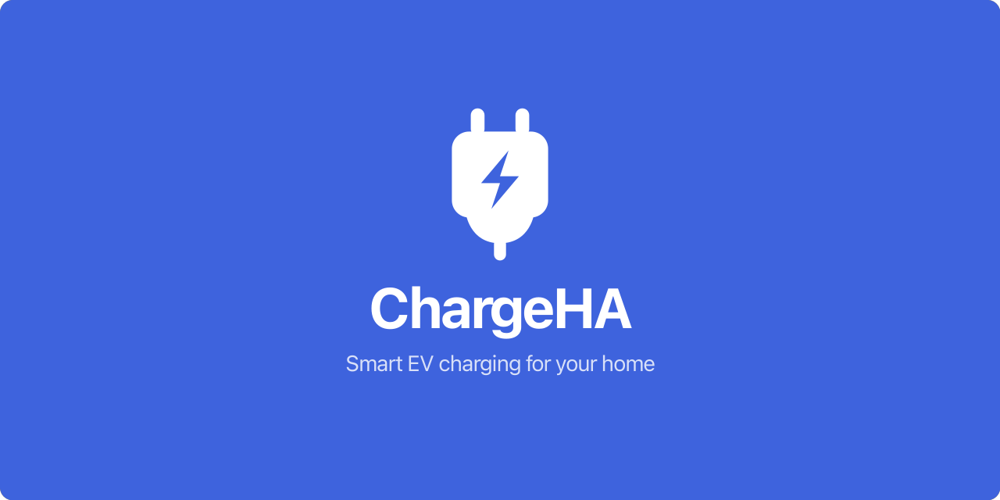
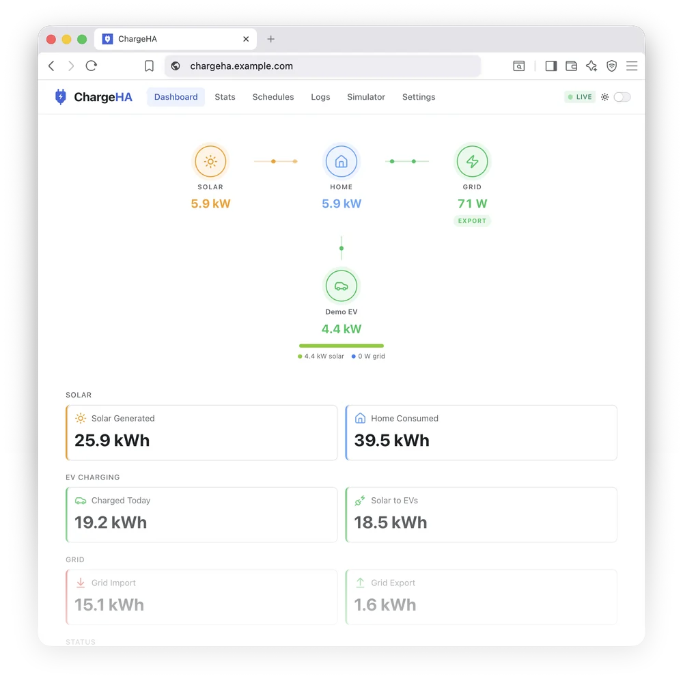

<p align="center">
  
</p>

Solar-aware EV charge controller for home automation. ChargeHA monitors your
solar production and intelligently manages EV charging to maximise
self-consumption — with advanced scheduling and notifications. Set and forget.

## Contents

- [Contents](#contents)
- [Demo](#demo)
- [ChargeHQ.net](#chargehqnet)
- [Features](#features)
  - [Reporting](#reporting)
- [Supported Integrations](#supported-integrations)
  - [Coming Soon](#coming-soon)
- [Notes about Tesla](#notes-about-tesla)
  - [Onboarding (setup wizard)](#onboarding-setup-wizard)
  - [Polling cadence (data calls)](#polling-cadence-data-calls)
  - [Online probe (transition detection)](#online-probe-transition-detection)
  - [Wake calls](#wake-calls)
  - [Charge-rate (amps) updates](#charge-rate-amps-updates)
- [How It Works](#how-it-works)
- [Quick Start](#quick-start)
- [Mobile \& Home Screen](#mobile--home-screen)
- [Getting Started](#getting-started)
  - [Docker (recommended)](#docker-recommended)
  - [Local Development](#local-development)
  - [Devtools](#devtools)
- [Environment Variables](#environment-variables)
- [Database Migrations](#database-migrations)
  - [Encryption Key](#encryption-key)
- [Roadmap](#roadmap)
  - [Smart Charger Support (OCPP)](#smart-charger-support-ocpp)
- [Tech Stack](#tech-stack)
- [App Tour Video](#app-tour-video)
- [Contributing](#contributing)
  - [Plugin architecture](#plugin-architecture)
  - [Adding an inverter](#adding-an-inverter)
  - [Vehicles and chargers](#vehicles-and-chargers)
  - [Before you open a PR](#before-you-open-a-pr)
- [Contributors](#contributors)

## Demo

ChargeHA has a demo mode that lets you review the features without installing.
It runs entirely in the browser.
[Try it here](https://startswithaj.github.io/ChargeHA/). Or view the
[app tour video](#app-tour-video) below.

## ChargeHQ.net

ChargeHA is a self-hosted app that aims to have feature parity with
[ChargeHQ](https://chargehq.net/). ~~ChargeHQ is a very stable, reliable charge
controller. It's only $7.99 AUD, so highly recommended if you don't care about
self-hosting.~~

**ChargeHQ is shutting down.** If you're a ChargeHQ user looking for a
replacement, ChargeHA is built to fill that gap — self-hosted, no subscription,
and your data stays on your own hardware.

ChargeHA is not affiliated with, endorsed by, or associated with ChargeHQ.

## Features

- **Solar tracking** — dynamically adjusts charging amps based on available
  solar excess (or gross production), with configurable grace periods to ride
  out cloud cover
- **Solar + grid fallback** — optionally draw from the grid at minimum amps when
  solar is insufficient, instead of stopping entirely
- **Home battery priority** — hold EV charging until your home battery reaches a
  configured state-of-charge threshold
- **Charge scheduling** — time-based schedules with day-of-week selection,
  per-vehicle amperage, and target charge limits
- **Blockout schedules** — prevent charging during peak tariff windows
- **Real-time dashboard** — live energy flow diagram showing solar, grid,
  battery, and EV power with vehicle status cards
- **Notifications** — Telegram alerts for charge start/stop, plug events, low
  solar, energy outages, and errors
- **Setup wizard** — guided first-run configuration for vehicles, inverters,
  location, and auth
- **Plugin architecture** — modular adapters for vehicles, energy sources, and
  chargers, extensible without touching core code
- **Smart charger control** — charge via an OCPP 1.6J wallbox or a smart plug,
  with or without a vehicle API; solar tracking works on surplus watts alone
- **Multiple charging points** — run several chargers at once, each with its own
  schedules, and assign a charger to a vehicle so state-of-charge and charge
  limits apply

### Reporting

- **Tariff-aware cost tracking** — records the active electricity rate per
  reading and breaks down charging costs by tariff period
- **Historical stats** — day/month/year charts for energy production,
  consumption, and charging costs with per-vehicle breakdowns

## Supported Integrations

| Category      | Integration                      | Details                                                                                                                                                                                                                                                                                                  |
| ------------- | -------------------------------- | -------------------------------------------------------------------------------------------------------------------------------------------------------------------------------------------------------------------------------------------------------------------------------------------------------- |
| Vehicles      | **Tesla**                        | Fleet API with virtual key pairing, charge control, wake, and location tracking                                                                                                                                                                                                                          |
| Vehicles      | **Simulated**                    | Demo/dev adapter with adjustable SOC and plug state                                                                                                                                                                                                                                                      |
| Energy        | **Fronius (local)**              | Direct HTTP polling of inverters on your LAN, with auto-discovery                                                                                                                                                                                                                                        |
| Energy        | **Fronius (cloud)**              | Remote monitoring via the Fronius Solar API                                                                                                                                                                                                                                                              |
| Energy        | **Sigenergy (local)**            | Direct Modbus TCP integration on your LAN, with auto-discovery; requires Modbus to be enabled by your installer                                                                                                                                                                                          |
| Energy        | **Enphase (local)**              | Direct HTTPS polling of the Envoy / IQ Gateway on your LAN (firmware 7+), with auto-discovery and token renewal                                                                                                                                                                                          |
| Energy        | **GoodWe (Cloud / SEMS Portal)** | Remote monitoring via your GoodWe account login; supports both the legacy SEMS Portal and the newer SEMS+ backend; requires a GoodWe HomeKit or smart meter for grid and consumption readings                                                                                                            |
| Chargers      | **OCPP 1.6J**                    | Any OCPP 1.6J charger on your LAN — ABB, Wallbox, go-e, Fronius Wattpilot, MG ChargeHub, Ocular, ZJ Beny, Schneider and more. The charger connects to ChargeHA by WebSocket, no cloud account; paired by listening for the charge point ID it announces. See [compatibility list](docs/ocpp-chargers.md) |
| Chargers      | **Simulated**                    | Dev/demo charging point with plug state and adjustable draw                                                                                                                                                                                                                                              |
| Chargers      | **Tapo P110/115**                | Switches a standard EVSE on and off via a TP-Link smart plug on your LAN, with auto-discovery; requires "Third-Party Compatibility" to be enabled in the Tapo app (Me → Third-Party Services), and an energy-monitoring model — the plug's power reading is how charging is detected                     |
| Notifications | **Telegram**                     | Alerts for charging events, errors, and energy outages                                                                                                                                                                                                                                                   |
| Auth          | **OIDC**                         | Single sign-on via any OpenID Connect provider                                                                                                                                                                                                                                                           |

### Coming Soon

| Category | Integration        | Details                                                                  |
| -------- | ------------------ | ------------------------------------------------------------------------ |
| Energy   | **More inverters** | SolarEdge, Sungrow, and Growatt — the most popular brands beyond Fronius |

## Notes about Tesla

Tesla provide private users with $10 USD of Fleet API credit per month. The
billable calls ChargeHA uses are:

- **Wake** (~$0.02) — wakes a sleeping vehicle
- **Data** (~$0.002) — fetches charge/battery/location state
- **Commands** (~$0.001 each) — `set_charging_amps`, `start_charge`,
  `stop_charge`
- **Vehicles** — lists vehicles and their online/offline status (free)

One of the goals of ChargeHA is to run entirely on your local network without
exposing anything to the internet. So we **pull** state from Tesla on demand
rather than using the telemetry API, which is cheaper but requires exposing a
public HTTPS endpoint for Tesla to push updates to. Telemetry may be supported
in the future — for now ChargeHA schedules API calls to balance cost (under
$10/month) and charge responsiveness.

### Onboarding (setup wizard)

Connecting a Tesla is a two-part process:

1. **Tesla developer registration** (manual, one-time) — create a free developer
   account at [developer.tesla.com](https://developer.tesla.com/), register an
   application, and note your Client ID and Client Secret. The wizard shows the
   exact Allowed Origin URL and Redirect URI to whitelist when you reach that
   step.
2. **ChargeHA setup wizard** (guided) — walks through the rest:

   1. **Key Generation** — generate or import an EC P-256 key pair (private key
      stored encrypted when `ENCRYPTION_KEY` is set)
   2. **Public Key Hosting** — Tesla must fetch your public key from an HTTPS
      URL; the wizard offers Cloudflare Tunnel (recommended, no account needed),
      self-hosting, or GitHub Pages
   3. **Tesla Credentials** — enter Client ID, Client Secret, and region (NA,
      EU, or CN)
   4. **Partner Registration** — runs automatically; safe to re-run
   5. **Tesla Authorization** — OAuth login and consent via Tesla's site
   6. **Vehicle Selection** — pick which vehicles to manage, with priority
      ordering for solar allocation on multi-vehicle accounts
   7. **Virtual Key Pairing** — scan a QR code near the vehicle, approve in the
      Tesla app, and confirm on the car's screen

See [docs/tesla.md](docs/tesla.md) for the full step-by-step guide, including
recommended OAuth scopes and a manual (no-wizard) setup path.

### Polling cadence (data calls)

- **Every 10 minutes** when the vehicle should be charging — i.e. a schedule is
  active or there is excess solar. This applies whether the car is already
  charging or still needs to be started.
- **Every 20 minutes** when there is no reason to charge (overnight, no
  schedule, no excess solar).
- **Every 3 minutes** when we have no cached state yet (just after startup or
  plug-in).

Consequences:

- When plugged in, charging may start up to 10 minutes after the trigger
  condition. Press **Update** in the app to force an immediate refresh.
- Charging may overshoot the goal state-of-charge by a small amount, since the
  next poll is up to 10 minutes away. Scheduled charges still stop at the
  scheduled end time.

### Online probe (transition detection)

The free `/vehicles` endpoint is polled **every controller loop** (or every
minute, whichever is less frequent) which is used to discover transitions where
the car wakes itself — plug-in, drive home, the user opening the Tesla app —
without paying for a wake. When an asleep→online transition is detected, we
immediately pull a fresh `vehicle_data` read so the cache reflects the new
`isPluggedIn` / battery / location values before the next decision tick.

Without this, a plug-in event during a fresh-cache window (up to 20 min idle)
would be invisible until the cache aged out, causing missed schedules or forcing
many wakes.

### Wake calls

Wake is rate-limited to **once per hour** per vehicle, and is skipped when:

- the cached battery level is already at or above the charge limit (battery only
  drops while asleep, so a cached "full" reading stays valid), or
- the cached state shows the car is **not plugged in** (Tesla wakes itself on
  plug-in, so the free `/vehicles` probe will catch that path — no point
  spending $0.02 waking an unplugged car).

Blockouts never trigger a wake; schedules and solar do.

### Charge-rate (amps) updates

`set_charging_amps` is only sent when the target differs from the last value we
sent. On top of that, an **amp debounce** smooths small solar fluctuations:

- **Change ≥ `ampDebounceThreshold`** (default: 2A) — applied immediately on the
  next decision tick.
- **Change < `ampDebounceThreshold`** — held until the new target stays steady
  for `ampDebounceSettleMinutes` (default: 3 minutes). If the target moves again
  before the timer elapses, the timer resets.

Both thresholds are configurable in Settings. The more frequently amps are
updated (lower threshold, shorter settle time), the tighter solar tracking
follows real-time production — at the cost of more API calls.

## How It Works

ChargeHA runs a **configurable decision loop** (default 30 seconds) that
evaluates each charging point through a priority pipeline:

1. **Pre-checks** — is the vehicle plugged in, at home, and below its charge
   limit?
2. **Blockout schedules** — stop if inside a blockout window
3. **Charge schedules** — charge at the scheduled amps if a schedule is active
4. **Battery priority** — hold if home battery SOC is below the configured
   threshold
5. **Solar tracking** — calculate available solar and convert to amps
6. **Fallback** — stop charging if none of the above apply

A configurable grace period (default 6 min) keeps the charger running at the
minimum charge rate through brief solar dips, and a cooldown period (default 15
min) prevents rapid on/off cycling.

## Quick Start

Run the prebuilt image from GitHub Container Registry — no build required.

Generate an encryption key once and keep it — it encrypts the secrets stored in
the database, and the same key must be passed to every future container
(upgrades included) or those secrets can no longer be decrypted:

```bash
openssl rand -base64 32 > chargeha.key
```

```bash
docker run -d --name chargeha \
  -p 8000:8000 \
  -v chargeha-data:/app/data \
  -e ENCRYPTION_KEY=$(cat chargeha.key) \
  ghcr.io/startswithaj/chargeha:latest
```

Open `http://localhost:8000` and follow the setup wizard.

`-v chargeha-data:/app/data` stores the SQLite database (all settings, secrets,
and energy history) in a named Docker volume so it survives container removal
and image upgrades. Without it, the database is deleted with the container.

Images are published to `ghcr.io/startswithaj/chargeha`:

- `latest` / `main` — current `main` branch
- `v2026.06.10` — date-based release tags
- `branch-<name>` — per branch, `pr-<n>` per pull request
- `sha-<short>` — every build

## Mobile & Home Screen

Fully responsive and installable to your home screen (web manifest, standalone):

- **Android (Chrome):** ⋮ menu → **Add to Home screen**.
- **iOS (Safari):** **Share** → **Add to Home Screen**.

## Getting Started

### Docker (recommended)

```bash
# Build
docker buildx build -f docker/Dockerfile --platform linux/amd64 -t chargeha .

# Run (generate chargeha.key once: openssl rand -base64 32 > chargeha.key)
docker run -d --name chargeha \
  -p 8000:8000 \
  -v chargeha-data:/app/data \
  -e ENCRYPTION_KEY=$(cat chargeha.key) \
  chargeha
```

Open `http://localhost:8000` and follow the setup wizard.

### Local Development

```bash
# Install dependencies
deno install

# Start dev server (backend + frontend with hot reload)
deno task dev

# Or run them separately
deno task dev:server
deno task dev:client
```

To test **Tesla commands** locally (start/stop, set amps), install Tesla's HTTP
proxy so it's on your `PATH` — ChargeHA spawns and manages it automatically on
port 4443 (requires Go):

```bash
go install github.com/teslamotors/vehicle-command/cmd/tesla-http-proxy@latest
```

Vehicle _data_ works without it; if the binary is missing the server logs
`tesla-http-proxy binary not found … skipping proxy start` and commands fail.

Before committing, run the full quality gate:

```bash
deno task check:all
```

It runs formatting, linting, type-checking, plugin-ref checks, unused-file
detection, and all tests.

### Devtools

The `devtools/` directory contains development utilities, each with its own
README:

- [Database CLI](devtools/db/README.md) — reset, seed, and snapshot management
- [Lint Plugins](devtools/lint-plugins/README.md) — custom Deno lint rules
- [OIDC Provider](devtools/oidc/README.md) — local identity provider for testing
  SSO
- [Quality Checks](devtools/quality/README.md) — unused file detection
- [Simulators](devtools/sim/README.md) — solar and charge simulations
- [SEMS Simulator](devtools/sems-simulator/README.md) — fake GoodWe SEMS Portal
  cloud API for testing the GoodWe plugin without an account
- [OCPP Simulator](devtools/sap-ocpp-simulator/README.md) — standalone charge
  point for local development

## Environment Variables

Copy `.env.example` to `.env` and configure:

| Variable         | Default              | Description                                                   |
| ---------------- | -------------------- | ------------------------------------------------------------- |
| `PORT`           | `8000`               | HTTP server port                                              |
| `DB_PATH`        | `./data/chargeha.db` | SQLite database file path                                     |
| `LOG_LEVEL`      | `info`               | Log verbosity: `debug`, `info`, `warn`, `error`               |
| `ENCRYPTION_KEY` | _(none)_             | Base64-encoded 256-bit key for encrypting secrets (see below) |

All other configuration (Tesla, Fronius, notifications, etc.) is managed via the
**Settings UI** or **Setup Wizard**.

## Database Migrations

- Edit `packages/server/src/db/Schema.ts`
- `deno task db:generate` — emits a new `drizzle/NNNN_*.sql` file
- Migrations auto-apply on app startup via `MigrationRunner` (reads
  `drizzle/*.sql`, skips already-applied hashes)

Only `db:generate` is wired up. `db:migrate` / `db:push` were removed because
they invoke drizzle-kit, which requires `better-sqlite3` — a Node C++ native
addon that needs `--allow-ffi` permissions and platform-specific prebuilt
binaries (painful for arm64 dev → amd64 k8s cross-builds). The app runtime uses
`@db/sqlite` (pure Deno + WASM) and applies migrations itself on boot.

### Encryption Key

`ENCRYPTION_KEY` is optional but recommended. It encrypts sensitive data stored
in the database, such as Tesla virtual-key private keys and Fronius Cloud
passwords. Without it, features that require storing secrets will be
unavailable.

Generate one with:

```bash
openssl rand -base64 32
```

## Roadmap

- **More inverters** — SolarEdge, Sungrow, GoodWe, and Growatt
- **OCPP 2.0.1** — ChargeHA speaks 1.6J only

Smart charger support (OCPP 1.6J) has landed. See [docs/ocpp.md](docs/ocpp.md)
for how ChargeHA configures a charger's metering and reads 3-phase, and
[docs/ocpp-chargers.md](docs/ocpp-chargers.md) for tested hardware.

## Tech Stack

| Layer    | Technology                      |
| -------- | ------------------------------- |
| Runtime  | Deno                            |
| Server   | Hono                            |
| API      | tRPC v11 with SSE subscriptions |
| Database | SQLite (Drizzle ORM)            |
| Client   | React 18, Vite, TypeScript      |
| UI       | Radix UI Themes, Recharts       |
| Auth     | Argon2 (local), OIDC (SSO)      |

## App Tour Video

<p align="center">
  
</p>

## Contributing

Contributions are very welcome — especially **new vehicles, inverters, and
chargers**. If you own hardware ChargeHA doesn't support yet, adding it is
usually a weekend's work.

New features will be considered, but not every feature can be included. Feature
bloat is a real issue in the age of AI, and the codebase cannot stay manageable
if every vibe-coded feature is merged. ChargeHA has a plugin architecture for
charger, inverter, and vehicle integrations. I'm open to extending that plugin
architecture to other, more core features that people can opt into — and to PRs
along those lines — but the codebase does not have this capability today.

### Plugin architecture

Every integration lives in `packages/plugins/` as a self-contained plugin. Core
code never references a plugin by ID — plugins register themselves into
`VehiclePluginRegistry` / `EnergyPluginRegistry` / `ChargerPluginRegistry` at
boot and everything else talks to them through interfaces. That means a new
integration is _additive_: you create a folder, register it in one place, and
touch no existing logic.

A plugin owns its own:

- **Adapter** — the device protocol (HTTP, Modbus TCP, cloud API)
- **Config schema** — declarative; the settings UI renders itself from it
- **tRPC router** — optional, for plugin-specific actions like discovery
- **Client components** — settings panel and setup-wizard steps
- **Health checks** — surfaced as dashboard warnings when the device is unhappy

### Adding an inverter

An energy plugin only has to answer one question: _what is the power flow right
now?_ The whole adapter contract is five methods:

```ts
export interface EnergySourceAdapter {
  connect(): Promise<void>;
  disconnect(): Promise<void>;
  getRealtimeData(): Promise<EnergyData>;
  getDeviceInfo(): Promise<DeviceInfo>;
  pollIntervalSeconds(): number;
}
```

`getRealtimeData()` returns solar production, grid power (positive = import,
negative = export), home consumption, and optional battery power/SOC. Once those
numbers are flowing, solar tracking, scheduling, blockouts, stats, and
notifications all work for free.

The plugin wrapper around it is thin:

```ts
export class MyInverterPlugin implements EnergyPlugin {
  readonly id = "my_inverter";
  readonly displayName = "My Inverter (Local)";
  readonly vendor = "MyBrand";
  readonly configDef = myInverterConfigDef;
  readonly secretKeys: readonly string[] = [];

  constructor(private readonly deps: PluginDependencies) {}

  async createAdapter(): Promise<EnergySourceAdapter> {
    const host = await this.deps.getConfig("host");
    if (!host) throw new Error("Host not configured");
    return new MyInverterAdapter(host, this.deps.log);
  }
  // ...getRouter(), getHealthChecks(), shutdown()
}
```

Then one line in `packages/plugins/registerPlugins.ts`:

```ts
energyRegistry.register(new MyInverterPlugin(make("my_inverter")));
```

Copy `packages/plugins/energy/fronius-local/` (HTTP) or `sigenergy-local/`
(Modbus TCP) as your starting point — both include auto-discovery, config UI,
and adapter tests.

### Vehicles and chargers

Vehicle plugins implement `VehiclePlugin` + `VehicleMiddleware` — the middleware
layer exists so plugins can apply their own caching and cost model (the Tesla
plugin optimises hard against Fleet API pricing). Start from
`packages/plugins/vehicles/simulated/` for the minimal shape.

Charger plugins implement `ChargerPlugin` and return a `ChargerAdapter`. Start
from `packages/plugins/chargers/simulated/` for the minimal shape, `tapo/` for a
LAN device, or `ocpp/` for a protocol server. A charger plugin owns a charger
row — config and secrets are stored per charger, so a user can add several of
the same type. Local test rigs live in `devtools/sap-ocpp-simulator/` and
`devtools/tapo-simulator/`.

### Before you open a PR

- Read [docs/code.md](docs/code.md) for conventions and project layout
- When running the app in dev, there is a style guide at `/components` that
  renders every shipped UI component from static fixtures. Use it to see the
  building blocks before writing plugin client components, and add your new
  components to it so they stay consistent — see
  [docs/settings-ui.md](docs/settings-ui.md) for the rules
- Add tests for your adapter (see the `test-helpers/` folders in existing
  plugins)
- Run `deno task check:all` — formatting, lint, types, plugin refs, and tests
  must all pass.

## Contributors

<table>
  <tr>
    <td align="center" width="120">
      <a href="https://github.com/mukaibot">
        
        <br /><sub><b>mukaibot</b></sub>
      </a>
    </td>
    <td>Sigenergy Local Plugin</td>
  </tr>
</table>
